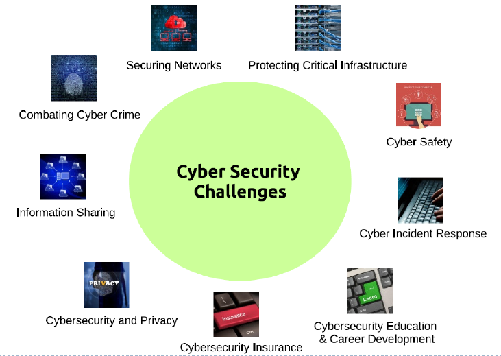

# CSCU9YS - Computer Security & Forensics

[TOC]

# Overview

- Cyberspace & the infrastructure are vulnerable to a wide range of risks. Cybercrime includes activities such as

  - stealing information and money
  - developing capabilities to distrupt, destroy, or threaten the delivery of essential services

- Example scenarios include

  - the production and distribution of child pornography
  - banking and financial fraud
  - intellectual property violations
  - any other crimes which have substantial human and economic consequences

## Difficulties in securing cyberspace

- Number of factors:
  - malicious attackers can operate from anywhere in the world
  - growing linkages between cyberspace and physical systems (i.e. smart city, connected home etc)
  - difficulty of reducing vulnerabilities, i.e. complex cyber networks
- Our concerns are to protect physical infrastructure which are intergrated with information technology and hence to cyberspace

## The big picture

## Big numbers

- Market size: \$77 bn in 2015 \$170 bn by 2020
- Cyber crime cost to businesses: \$400 to \$500 bn a year
- Cyber insurance: grown from \$1 bn to \$2.5 bn between 2013-15
- Security awareness training: over \$1 bn annually
- Mobile security growth: 30% annually projected through 2019
- UK cyber security industry: currently worth £17.6 bn - up 70% since 2013, employs over 100 000 people+
- UK pledged to increase spending on cyber security to £1.9 billion by 2020+

## Topics

- Adversaries & Attack
- Securing software
- Requirements
- Network security
- Cryptography
- Network types
- Forensics
- Human factors
- Indentification & authentication
- Security policies

# Adversaries & attacks

## Adversaries

### Individuals

#### Hackers/Cracker

- Original motivation is for expert knowledge and the power that it might give them (Ham radio, phone phreakers, computer geeks)
- Skills sets:
  - script kiddies
    - download toolkits but no real idea how they work
  - gray/black hats
    - passionite, highly motivated, skilled
    - not necessarily very coordinated
- Example:
  - Kevint Mitnick
    - jailed for numerous hacks and social engineering tricks
    - insists his motivation was more curiosity than financial gain
    - now works as a computery security consultant

#### Lone criminals

- Goal is making money
- Computer systems provide the environment and the method
- Often less skilled and will happily use available toolkits
  - whatever works and provides financial gain
  - Frequently audacious
  - Often caught out due to lack of knowledge

#### Insiders

- A malicious or sigruntled employee can be very destructive, particulalry if compoter systems are very open or an individual has wide access to systems and data
- Safest option is to operate on a 'need to know' basis
  - Authorisation lelvls and authentication (eg DB access levels)
  - Military systems (and some terrorist organisations - Cells)
- Can be very restrictive and affect normal operations
  - Many security breaches occur because individuals get tired of using the required secure approach
- Most desctrive effect occurs when malicious insider keeps quiet and works with external individuals to maximise damage

### Organisations

Organisations that may be interested in looking for security weaknesses

#### Businesses

- Businesses have always strived to get a competitive advantage over their competitors. They may therefore be interested in looking for security weaknesses in their rivals
  - Intention is usually to gain information of tactical value (eg design plans)
  - Rare that they would actively attack and undermine a competitor
  - This would normally be illegal
- Example:
  - Israeli Modi'in Ezrahi private investigators (PI)
    - This group installed a trojan horse at businesses targeted by their clients
    - Trojan allowed PI  group to collect information on rival businesses
    - Members of PI group ended up in jail or heavily fined

#### Organised crime

- Organised crime is a key player in international security breaches
  - Increasingly, there is more money to be made in online crime than in drugs
  - Organised crime has the resources and motivation to exploit security breaches. According to the National Crime Agency, they are winning the cyber arms race (**2.46 million** "cyber incidents" in 2015)
  - Some organised crime networks are said to have strong linkts to corrupt governments
- One of the more infamous groups is the 'Russian Business Network'
  - Alleged to provide the infrasctructure for the majority of modern e-crime
  - Implicated in significant share of online crime commited in the UK
  - Alleged linkts to Russian mfia and posibly even elements of government
- Nearly 20% of a survey of 41 000 US households reported an experience of identity theft
- A recent breach of the Experian Credit Reference agency led to the leaking of details regarding 143 million US citizens. This information is sufficient to enable attackers to take out personal loans in the names of the people whose details they have.

#### Terrorists

- Two significant goals for terrorist groups using security exploits
  - Financial gain to fund activites - similar methods to criminal groups
  - Creating terror through control and destruction of critical infrastructure
- Current focus appears to be on financial gain but the long term danger is when critical infrastructure are attacked (eg power, water, communications)
- Modern power stations are network to provide flexible generation and control of power output. This system is suspectible to attack and can bring a country to a standstill
- More examples:
  - nuke plant network
  - tram set
  - steel mill
  - air traffic control system

#### Governments (CIA/NSA, MI6/GCHQ, FSB, BND)

- When hackers, criminals and insiders team up, you have a problem. If a government forms a similar team, you have a much bigger problem
  - Cuckoo's Egg, Cliff Stoll
    - One of the first recorded instances of hacking US military sites and how it was tracked down to KGB
  - Israeli air attack on Syria
    - command and control, radar systems switched off - Aviation Week
  - Greek telephone hack
    - Conversations of senior Greek politicans were monitored by compromising telephone switches and 'tapping' software modules in the switches. Notable, all relevant logging tools were disabled so hackers could not be traced
  - Iranian uranium enrichment facilities: stuxnet
  - Infrastructure control plants
  - NSA/GCHQ & PRISM, NSA/BND & Xkeyscore
  - Russia: Cyberwar Superpower
  - China

## Attacks

### Criminal

The goal for criminal attacks is usualyl financial gain, either directly or indirectly

#### Fraud

- 419 scams
  - 419 originates from Nigerian Criminal Code
  - A social engineering scam that relies on greed where victim assumes they will receive a large payout for helping transfer cash. First they most provide money up front to help start the process
  - Originally a large source of spam e-mail
- Phishing - createing a false website / login account to harvest user details
  - Gain access to account name and password for financial gain
  - XSS and recent DNS bug make this dangerous threat
  - Spyware aimed at Western governments and journalists
- Virus laden or spoofed emails puporting to comr from legitimiate user
  - User opens fraudulent attachment which installs torjan virus
  - Many different types of attachment are dangrous: EXE, PIF, BAT, ZIP

#### Damage

- Motivation
  - terrorism
  - malice
  - revenge
- Method
  - shutdown of network and attached systems
    - Coud include business, defense or utilities
  - deletion of data, user accounts or both
  - allow infiltration of 3rd party who will inflict the real damage

#### IP Theft

- Examples
  - design documents
  - source code
  - software applications (warez)
    - a good way to disseminate trojans
    - even the hackers get caught out via 'back doors' in downloaded hacker tools
  - Music, videos, Games
- Digital media is relatively easy to copy and disseminate - not contrained by duplication resources and copy is usually a perfect replica

#### Identity theft

- Stealing a person's indentity can be very damaging and cause significant frustration for the affected victim
  - for example, if a flase credit card is created in your name, you may have to prove that you did not buy a given product or transfer funds to a mystery account
  - Thievess used to steal indentity paperwork (eg bills, bank statements) from bins or even houses. Now they can just get it all online
  - Authentication processes for creating new accounts etc are often very weak and have not really caught up with the ability of fraudsters to fake or obtain relevant information

#### Data theft

- Very common form of attack where goal is to obtain confidential data with the aim of using it for financial gain, eg user account details, credit card numbers
- Frequently the aim of web site attcak where such information is normally stored

### Privacy

#### Targeted surveillance

- A small group or even an individual may be singled out due to the potential to exploit them financially, politically or militarily
  - Standard techniques may be to install a key listener via a torjan or eavesdrop on network communications
    - Packet sniffing software is very common and gives access to unencrypted data
    - You can target service (eg email) and a source of desination computer with ease
  - Precrime (China)

#### Data harvesting

- More commonly, attackers will listen out on compoters and network communications and look for interesting patterns or phrases, eg text fields in forms with names like password
- Storage of such data is less of an issue, the bigger concern is analysing the vast amount of data that can be generated
- Companies already recrod and analyse user browsing behaviour across many independent web sites. For example, Google and Doubleclick keep track of users moving from one site to another via javascript and cookies
- Your face is big data

##### Surveillance

- 

##### Traffic analysis & metadata

- Traffics analysis looks at not just what you say, but who you say it to
- This is part of the 'metadata' of communications and can revael a lot about an individual

##### Key analysis

- Often used by military and law enforcement to identify key individuals
  - NSA/GCHQ and ECHELON monitor and analyse network traffic for this purpose
  - Look for certain patterns of communication or tags in data (or even just data that is encrypted) to identify individuals and the computers they use
  - Ptential terrorist cells have a communication structure that is relatively unique
    - First spot the structure, then investigate further
    - Scanning for network structures is much quicker than looking at actual conversations

### Publicity

- Undermine a service with the goal of either removing it or extorting 'protection' money

##### Blackmail / Denial of service

- For example a denial of service may be launched against a web site making it unreachable
- If time critical information is required (eg On Line Bookies), organisations may pay up in the hope the attacker will go elsewhere

##### Web site defacement

- This is less subtle and usually aims to undermine the credibility of an organisation
  - E.g. defacing supposeldy secure systems on bank web site or a security companies site
  - Less frequent these days since hackers more interested in making money that showing off
- Gain publicity, noteriety or influence opinion
  - Sometimes the goal is to gain media attention for some cause or just to get noticed by their peers